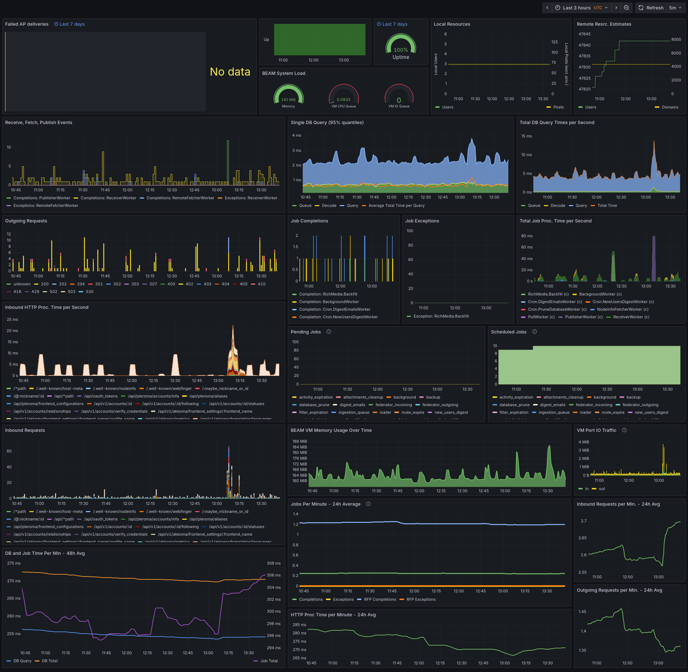

# Monitoring Akkoma

If you run Akkoma it’s a good idea to collect metrics to ensure your instance is running smoothly
without anything silently failing and to aid troubleshooting if something actually goes wrong.

To facilitate this, Akkoma exposes Prometheus metrics to be scraped for long-term 24/7 monitoring
as well as as two built-in dashboards with ephemeral info about just the current status.
Setting up Prometheus scraping is highly recommended.

## Prometheus

This method gives a more or less complete overview and allows for 24/7 long-term monitoring.

Prometheus metric export can be globally disabled if you really want to,
but it doesn’t cause much overhead and is enabled by default: see the
[export\_prometheus\_metrics](../../configuration/cheatsheet#instance) config option.

Akkoma only exposes the current state of all metrics; to make it actually useful
an external scraper needs to regularly fetch and store those values.
An overview of the necessary steps follows.

### Step 1: generate a token

Accessing prometheus metrics, requires an OAuth2 token with the `admin:metrics` (sub)scope.
An access token with only this subscope will be unable to do anything at all _except_ looking at the exported metrics.

Assuming your account has access to the `admin` scope category,
a suitable metrics-only token can be conveniently generated using
[constanze](https://akkoma.dev/AkkomaGang/constanze).
If you didn’t already do so before, set up `constanze` by running `constanze configure`.
Now getting the token is as simple as running the below command and following its instructions:

```bash
constanze token --client-app --scopes "admin:metrics" --client-name "Prometheus"
```

Alternatively you may manually call into the token and app APIs;
check `scripts/create_metrics_app.sh` in the source tree for the process for this.

The resulting token will have the form `Bearer $ACCESS_TOKEN`;
in the following replace occurrences of `$ACCESS_TOKEN` with the actual token string everywhere.  
If you wish, you can now check the token works by manually using it to query the current metrics with `curl`:

!!! note
    After restarting the instance it may take a couple minutes for content to show up in the metric endpoint

```sh
curl -i -H 'Authorization: Bearer $ACCESS_TOKEN' https://myinstance.example/api/v1/akkoma/metrics | head -n 100
```

### Step 2: set up a scraper

You may use the eponymous [Prometheus](https://prometheus.io/)
or anything compatible with it like e.g. [VictoriaMetrics](https://victoriametrics.com/).
The latter claims better performance and storage efficiency.

Both of them can usually be easily installed via distro-packages or docker.
Depending on your distro or installation method the preferred way to change the CLI arguments and the location of config files may differ; consult the documentation of your chosen method to find out.  
Of special interest is the location of the prometheus scraping config file
and perhaps the maximal data retention period setting,
to manage used disk space and make sure you keep records long enough for your purposes.
It might also be a good idea to set up a minimal buffer of free disk space if you’re tight on that;
with VictoriaMetrics this can be done via the `-storage.minFreeDiskSpaceBytes 1GiB` CLI flag.

Ideally the scraper runs on a different machine than Akkoma to be able to
distinguish Akkoma downtime from scraper downtime, but this is not strictly necessary.

Once you’ve installed one of them, it’s time to add a job for scraping Akkoma.
For Prometheus the `scrape_configs` section will usually be added to the main config file,
for VictoriaMetrics this will be in the file passed via `-promscrape.config file_path`.
In either case a `scrape_configs` with just one job for a single Akkoma instance will look like this:

```yaml
scrape_configs:
  - job_name: 'akkoma_scrape_job'
    scheme: https
    metrics_path: /api/v1/akkoma/metrics
    static_configs:
    - targets: ['myinstance.example']
    # reminder: no Bearer prefix here!
    bearer_token: '$ACCESS_TOKEN'
    # One minute should be frequent enough, but you can choose any value, or rely on the global default.
    # However, for later use in Grafana you want to match this exactly, thus make note.
    scrape_interval: '1m'
```

Now (re)start the scraper service, wait for a multiple of the scrape interval and check logs
to make sure no errors occur.

### Step 3: visualise the collected data

At last it’s time to actually get a look at the collected data.
There are many options working with Prometheus-compatible backends
and even software which can act as both the scraper _and_ visualiser in one service.
Here we’ll just deal with Grafana, since we ship a reference Grafana dashboard you can just import.

There are again multiple options for [installing Grafana](https://grafana.com/docs/grafana/latest/setup-grafana/)
and detailing all of them is out of scope here, but it’s nothing too complicated if you already set up Akkoma.

Once you’ve got it running and are logged into Grafana,
you first need to tell it about the scraper which acts a the “data source”.
For this go to the “Connections” category and select “Data Sources”.
Here click the shiny button for adding a new data source,
select the “Prometheus” type and fill in the details
matching how you set up the scraper itself.
In particular, **use the same `Scrape Interval` value!**

Now you’re ready to go to the “Dashboards” page.
Click the “New” button, select “Import” and upload or copy the contents of
the reference dashboard `installation/grafana_dashboard.json` from Akkoma’s source tree.
It will now ask you to select the data source you just configured,
as well as for the name of the job in your scraper config
and your instance domain+port identifier.
For the example settings from step 2 above
the latter two are `akkoma_scrape_job` and `myinstance.example:443`.
*(`443` is the default port for HTTPS)*

That’s it, you’ve got a fancy dashboard with long-term, 24/7 metrics now!
Updating the dashboard can be done by just repeating the import process.

Here’s an example taken from a healthy, small instance where
nobody was logged in for about the first half of the displayed time span:  


!!! note
    By default the dashboard does not count downtime of the data source, e.g. the scraper,
    towards instance downtime, but a commented out alternative query is provided in the
    panel edit menu. If you host the scraper on the same machine as Akkoma you likely want to swap this out.

### Remarks on interpreting the data

What’s kind of load and even error ratio is normal or irregular can depend on
the instance size, chosen configuration and federation partners.
*(E.g. when following relays, much more activities will be received and the received activities will in turn kick off more internal work and also external fetches raising the overall load)*

Here the 24/7 nature of the metric history helps out, since we can just
look at "known-good" time spans to get a feeling for what’s normal and good.
If issues without an immediately clear origin crop up,
we can look for deviations from this known-good pattern.

Still there are some things to be aware of and some common guidelines.

#### Panel-specific time ranges

A select few panels, are set to use a custom time range
independent from what you chose for the dashboard as a whole.
This is indicated with blue text next to the panel title.  
Those custom times only take precedence over _relative_ global time ranges.
If you choose fixed start and end dates in the global setting
*(for example to look at a long-term trend after a specific change)*
this will take precedence over custom panel times and everything follows the date range.

In the image above e.g. the uptime percent gauge thus considers the entire last week
while most other panels only display data for the last 6 hours.

#### Long-term trends

The lower section of the dashboard with 24h and 48h averages is particularly useful for observing long-term trends.
E.g. how a patch, version upgrade or database `VACCUUM`/`REINDEX` affects performance.

For small time ranges you can still look at them to make sure the values are at a reasonable level,
but the upper part is probably more interesting.

#### Processing times total

The actions counted by various “time per second” or “time per minute” stats are partially overlapping.
E.g. the time to conclude a HTTP response includes the time it took to run whatever
query was needed to fetch the necessary information from the database.
However not all database queries originate from HTTP requests.

But also, not all of the recorded time might have actually consumed CPU cycles.
Some jobs, e.g. `RemoteFetcherWorker`, will need to fetch data over the network
and often most of the time from job start to completion is just spent waiting
for a reply from the remote server to arrive.  
Even a few HTTP endpoints will need to fetch remote data before completing;
e.g. `/inbox` needs to verify the signature of the submission, but if the signing key
wasn’t encountered before it first needs to be fetched.
Getting deliveries from such unknown users happens more often than you might initially assume
due to e.g. Mastodon federating actor deletions to _every server it knows about_
regardless of whether there was ever any contact with the deleted user.
*(Meaning in the end the key lookup will just result in a `410 Gone` response and us dropping the superfluous `Delete`)*

Thus if you just add up all timing stats you’ll count some actions multiple times
and may end up consistently with more processing time being done than time elapsing on the wall clock
even though your server is neither overloaded nor subject to relative time dilation.

For keeping track of CPU and elixir-side(!) IO bottlenecks,
the corresponding BEAM VM gauges are much better indicators.
They should be zero most of the time and never exceed zero by much.

!!! note
    The BEAM VM (running our elixir code) cannot know about
    the database’s IO activity or CPU cycle consumption,
    thus this gauge is no indicator for database bottlenecks.

#### Job failures and federation

Most jobs are automatically retried and may fail (“exception”) due to no fault of your own instance
e.g. network issues or a remote server temporarily being overloaded.
Thus seeing some failures here is normal and nothing to be concerned about;
usually it will just resolve itself on the next retry.  
Consistent and/or a relatively high success-to-failure ratio though
is worth looking into using logs.

Of particular importance are Publisher jobs;
they handle delivering your local content to its intended remote recipients.
Again some PublisherWorker exceptions are no cause for concern,
but if all retries for a delivery fail, this means a remote recipient never
received something they should’ve seen.  
Due to its particular importance, such final delivery failures are
recorded again in a separate metric.
The reference dashboard shows it in the “AP delivery failures” panel.
Everything listed there exhausted all retries without success.  
Ideally this will always be empty and for small instances this should be the
case most of the time.
However, whenever a remote instance which once interacted with
your local instance in the past is decommissioned, delivery failures will likely
eventually show up in your metrics. For example:

 - a local user might be followed by an user from the dead instance
 - a local posts was in the past fetched by the dead instance and this post is now deleted;
    Akkoma will attempt to deliver the `Delete` to the dead instance even if there’s no follow relationship

Delivery failures for such dead instances will typically list a reason like
`http_410`, `http_502`, `http_520`-`http_530` (cloudflare’d instances), `econnrefused`, `nxdomain` or just `timeout`.

If all deliveries to a given remote instance consistently fail for a longer time,
Akkoma will mark it as permanently unreachable and stop even attempting to deliver
to it meaning the errors should go away after a while.
*(If Akkoma sees activity from the presumed dead instance again it will resume deliveries for future content, but anything in the past will remain lost)*

Large instances with many users are more likely to have (had) some relationship to
such a recently decommissioned instances and thus might see failures here more often
even if nothing is wrong with the local Akkoma instance.
If this makes too much noise, consider filtering out telltale delivery failures.

On the opposite side of things, a `http_401` error for example is always worth looking into!

## Built-in Dashboard

Administrators can access a live dashboard under `/phoenix/live_dashboard`
giving an overview of uptime, software versions, database stats and more.

This dashboard can also show a limited subset of Prometheus metrics,
however besides being limited it only starts collecting data when opening
the corresponding page in the browser and the history only exists in ephemeral browser memory.
When navigating away from the page, all history is gone.
However, this is not this dashboards main purpose anyway.

The usefulness of this built-in dashboard are the insights into the current state of
the BEAM VM running Akkoma’s code and statistics about the database and its performance
as well as database diagnostics.
BEAM VM stats include detailed memory consumption breakdowns
and a full list of running processes for example.

## Oban Web

This too requires administrator rights to access and can be found under `/akkoma/oban` if enabled.
The exposed aggregate info is mostly redundant with job statistics already tracked in Prometheus,
but it additionally also:

 - shows not-yet executed jobs in the backlog of queues
 - shows full argument and meta details for each job
 - allows interactively deleting or manually retrying jobs  
  *(keep this in mind when granting people administrator rights!)*

However, there are two caveats:
1. Just as with the other built-in dashboard, data is not kept around
    (although here a **short** backlog actually exists);
    when you notice an issue during use and go here to check it likely is already too late.
    Job details and history only exists while the jobs are still in the database;
    by default failed and succeeded jobs will disappear after about a minute.
2. This dashboard comes with some seemingly constant-ish overhead.
    For large instances this appears to be negligible, but small instances on weaker hardware might suffer.
    Thus this dashboard can be disabled in the [config](../cheatsheet.md#oban-web).
